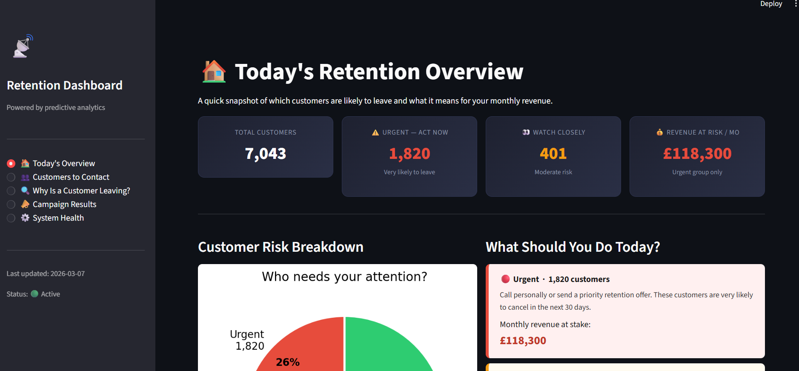
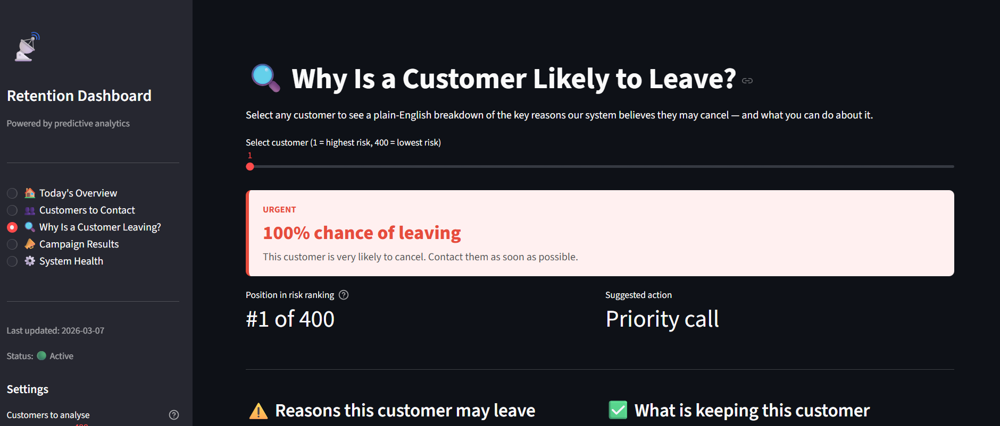
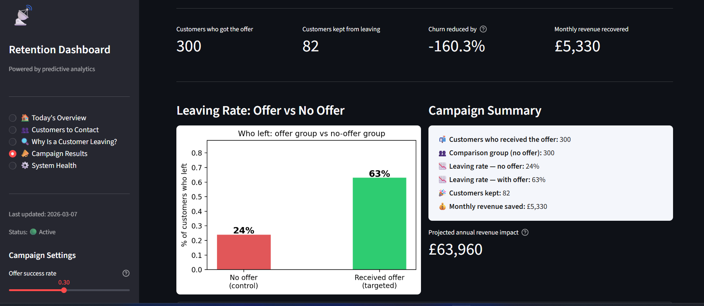

# Telco Customer Churn Analysis — End-to-End ML Pipeline & CRM Dashboard

A full end-to-end churn prediction system built on the **IBM Telco Customer Churn** dataset — from raw EDA and preprocessing all the way through model training, SHAP explainability, CRM integration, data drift monitoring, A/B testing, and an interactive **Streamlit retention dashboard**.

---

## Dashboard Preview

**Today's Overview**


**Churn Prediction View**


**Campaign & A/B Testing**


---

## Problem Statement

Customer churn is one of the most critical challenges in the telecom industry. Acquiring a new customer costs 5–10× more than retaining an existing one, making early identification of at-risk customers highly valuable.

This project answers:

- **Who** is likely to churn? (demographics, contract type, payment method)
- **When** is churn most likely? (tenure-based lifecycle stages)
- **What services** drive or prevent churn?
- **Which features** are the strongest predictors?
- **How confident** is the model in each individual prediction? (SHAP explainability)

---

## Key Findings

| Insight                            | Detail                                                                 |
| ---------------------------------- | ---------------------------------------------------------------------- |
| **Overall Churn Rate**             | 26.5% — moderately imbalanced (2.77:1 ratio)                           |
| **Highest-Risk Segment**           | New customers (0–12 months): **47.4% churn rate**                      |
| **Contract Type**                  | Month-to-month customers churn far more than annual/biannual contracts |
| **Internet Service**               | Fiber optic users churn significantly more (Pearson r = +0.31)         |
| **Payment Method**                 | Electronic check strongly associated with churn (r = +0.30)            |
| **Tenure**                         | Strongest negative predictor — longer tenure = lower churn (r = −0.35) |
| **Online Security / Tech Support** | Customers lacking these services churn measurably more                 |

---

## Project Structure

```
churn-analyze-crm/
├── app.py                              # Streamlit retention dashboard (entry point)
├── requirements.txt                    # Python dependencies
├── data/
│   ├── telco_customer_churn.csv        # Raw dataset (7043 rows × 21 cols)
│   └── telco_churn_processed.csv       # Cleaned & encoded output (7043 × 26)
├── models/
│   ├── rf_churn_model.joblib           # Trained Random Forest artifact
│   └── rf_churn_model_meta.json        # Model metadata (threshold, features, date)
├── notebooks/
│   ├── eda_prac.ipynb                  # Full EDA + preprocessing notebook
│   └── model_evaluation.ipynb          # Model training & evaluation notebook
├── src/
│   ├── deploy_model.py                 # Model packaging, loading & model card
│   ├── shap_analysis.py                # SHAP explainability (waterfall, bar, beeswarm)
│   ├── crm_integration.py              # Customer scoring, risk tiers, CRM CSV export
│   ├── drift_monitor.py                # PSI-based data drift detection & alerts
│   └── ab_testing.py                   # A/B test simulation & power analysis
├── reports/                            # Auto-generated SHAP plots & drift reports
└── img/                                # Dashboard screenshots
```

---

## Python Pipeline — `src/` Modules

### `deploy_model.py` — Model Packaging & Loading

Handles serialisation and deserialisation of the trained model artifact.

| Function             | Purpose                                                            |
| -------------------- | ------------------------------------------------------------------ |
| `package_and_save()` | Saves model + feature names + threshold to `.joblib` and `.json`   |
| `load_model()`       | Loads the artifact and returns `(model, feature_names, threshold)` |
| `model_card()`       | Returns a dict of model metadata for display in the dashboard      |

### `shap_analysis.py` — Explainability

Uses `shap.TreeExplainer` to explain every prediction made by the Random Forest.

| Function                | Purpose                                                        |
| ----------------------- | -------------------------------------------------------------- |
| `compute_shap_values()` | Samples up to 500 rows and computes SHAP values                |
| `plot_waterfall()`      | Single-customer waterfall chart (why this customer is at risk) |
| `plot_bar_importance()` | Global mean absolute SHAP bar chart                            |
| `plot_summary()`        | Beeswarm summary — global feature impact on churn probability  |
| `get_shap_df()`         | Returns a tidy DataFrame of SHAP values for export             |

### `crm_integration.py` — CRM Scoring & Segmentation

Scores the full customer base and segments into actionable risk tiers.

| Function             | Purpose                                                      |
| -------------------- | ------------------------------------------------------------ |
| `score_customers()`  | Runs model inference and assigns `churn_proba` + `risk_tier` |
| `get_tier_summary()` | Counts and revenue impact per risk tier                      |
| `top_at_risk()`      | Returns the top-N highest-risk customers                     |
| `export_crm_csv()`   | Exports scored customers to a CSV file for CRM upload        |

### `drift_monitor.py` — Data Drift Monitoring

Monitors for distribution shift between the training reference set and live data using **Population Stability Index (PSI)**.

| Function                      | Purpose                                                 |
| ----------------------------- | ------------------------------------------------------- |
| `compute_psi()`               | Calculates PSI for every numeric feature                |
| `drift_summary()`             | Classifies each feature as Stable / Monitor / Retrain   |
| `plot_feature_distribution()` | Overlaid KDE — reference vs current distribution        |
| `simulate_drift()`            | Synthetically injects drift for dashboard demonstration |

PSI thresholds: **< 0.10** Stable · **0.10–0.25** Monitor · **> 0.25** Retrain

### `ab_testing.py` — Campaign A/B Testing

Simulates a retention campaign experiment and provides statistical significance testing.

| Function                 | Purpose                                                                    |
| ------------------------ | -------------------------------------------------------------------------- |
| `run_ab_test()`          | Splits high-risk customers into control/treatment; computes lift & p-value |
| `power_analysis_table()` | MDE vs required sample size table for experiment planning                  |

---

## Streamlit Dashboard — `app.py`

Run the interactive dashboard locally:

```bash
streamlit run app.py
```

The dashboard has four tabs:

| Tab                     | What it shows                                                               |
| ----------------------- | --------------------------------------------------------------------------- |
| **Today's Overview**    | KPI cards (churn rate, at-risk count, revenue at risk), risk tier breakdown |
| **Prediction View**     | Per-customer SHAP waterfall, sortable risk table, individual score cards    |
| **Drift Monitor**       | PSI scores per feature, distribution overlays, retrain alerts               |
| **Campaign / A/B Test** | A/B test results, lift metrics, power analysis table                        |

---

## Dataset

**Source:** [IBM Telco Customer Churn](https://www.kaggle.com/datasets/blastchar/telco-customer-churn)

| Field Group  | Columns                                                                                                                                                   |
| ------------ | --------------------------------------------------------------------------------------------------------------------------------------------------------- |
| Demographics | `gender`, `SeniorCitizen`, `Partner`, `Dependents`                                                                                                        |
| Account Info | `tenure`, `Contract`, `PaperlessBilling`, `PaymentMethod`, `MonthlyCharges`, `TotalCharges`                                                               |
| Services     | `PhoneService`, `MultipleLines`, `InternetService`, `OnlineSecurity`, `OnlineBackup`, `DeviceProtection`, `TechSupport`, `StreamingTV`, `StreamingMovies` |
| Target       | `Churn` (Yes / No)                                                                                                                                        |

---

## Notebook Walkthrough

### `eda_prac.ipynb` — EDA & Preprocessing

| Section                            | What it does                                                                                |
| ---------------------------------- | ------------------------------------------------------------------------------------------- |
| **1. Data Loading & Inspection**   | Load CSV, inspect dtypes, check shape and nulls                                             |
| **2. Data Cleaning**               | Coerce `TotalCharges` to numeric, fill 11 NaNs, drop `customerID`, remap `SeniorCitizen`    |
| **3. Univariate & Bivariate EDA**  | Churn distribution, histograms by churn, categorical breakdowns                             |
| **4. Outlier Detection & Capping** | IQR boxplots on `tenure`, `MonthlyCharges`, `TotalCharges`; cap at [Q1−1.5×IQR, Q3+1.5×IQR] |
| **5. Feature Engineering**         | `TenureGroup` (5 ordinal bands), `AvgMonthlySpend` (TotalCharges / tenure+1)                |
| **6. Encoding**                    | Binary Yes/No → 0/1; OHE for `InternetService`, `Contract`, `PaymentMethod`                 |
| **7. Feature Scaling**             | StandardScaler on continuous features                                                       |
| **8. Correlation Analysis**        | Pearson correlation ranking vs `Churn_Numeric`                                              |
| **9. Export**                      | Save `data/telco_churn_processed.csv`                                                       |

### `model_evaluation.ipynb` — Model Training & Evaluation

Covers Random Forest training, threshold tuning, SMOTE for class imbalance, and evaluation metrics (ROC-AUC, precision-recall, confusion matrix).

---

## Environment Setup

### Option A — Conda (Recommended)

```bash
conda create -n churn-env python=3.10 -y
conda activate churn-env
pip install -r requirements.txt
streamlit run app.py
```

### Option B — Python venv

```bash
python -m venv venv
# Windows:
venv\Scripts\activate
# macOS / Linux:
source venv/bin/activate

pip install -r requirements.txt
streamlit run app.py
```

---

## Dependencies

```
pandas · numpy · matplotlib · seaborn · scikit-learn
imbalanced-learn · xgboost · shap · streamlit · scipy · joblib
```

> Install all at once: `pip install -r requirements.txt`

---

## Output — Processed Dataset

`data/telco_churn_processed.csv` contains:

- **7043 rows × 26 columns** (25 features + 1 target)
- All features fully numeric (`int64` / `float64`)
- No missing or infinite values
- Continuous features z-score scaled
- All categorical features one-hot encoded

---

## Branch Structure

| Branch        | Purpose                  |
| ------------- | ------------------------ |
| `main`        | Stable, reviewed code    |
| `eda_analyze` | EDA & preprocessing work |
